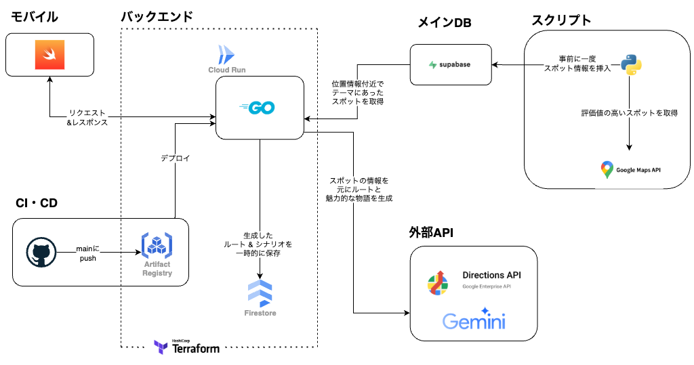

# Team8-App

Team8 の散歩アプリ用バックエンド＋インフラ用のリポジトリです。

## 📋 概要

ユーザーが選んだテーマに基づき、日常の移動を**ユニークな散歩体験へと変える**ルートを提案するモバイルアプリ用 API です。

### **主な機能**

- **位置情報に基づくルート生成**  
   POI の緯度経度は、PostGIS 拡張機能が提供する`GEOMETRY`型で管理しています。これにより、空間インデックスを活用した高速な近傍検索で、テーマに合う魅力的なスポットを効率的に絞り込みます。そして、選出した 3〜4 つの POI を巡る最適な順路と歩行ルートは、**Google Maps Directions API を用いて生成**。ルート自体は AI ではなく、この地理空間情報とロジックによって決定され、「意味のある寄り道」を設計します。

- **AI による物語性の付与**  
   ロジックによって構築されたルートに対し、**Gemini API**を活用してコンテキストに合わせた物語を生成・付与します。ルート、経由地の特徴、天候や時間帯といったリアルタイム情報を組み合わせることで、散歩に感情的な深みと楽しさを加えます。

- **複数のテーマとモード**  
   グルメ、自然、歴史・文化、アートなど、様々な散歩テーマに対応。目的地までの道のりを豊かにする「寄り道モード」と、時間を決めて未知の出会いを楽しむ「お散歩モード」を提供。

## 🏗️ システムアーキテクチャ


#### 主要な使用パッケージ

- **gin-gonic/gin** (v1.10.1) - HTTP フレームワーク
- **supabase-community/supabase-go** (v0.0.4) - データベース接続
- **paulmach/orb** (v0.11.1) - 地理情報処理
- **cloud.google.com/go/firestore** (v1.18.0) - Firestore 接続

## 🏁 クイックスタート

### 前提条件

- Go 1.23.0 以上
- Docker (ローカル開発用)
- Google Cloud CLI (デプロイ用)
- Terraform (インフラ管理用)

### 環境変数設定

```bash
# .envファイルを作成
cp .env.example .env

# 必要な環境変数を設定
export SUPABASE_URL="your_supabase_url"
export SUPABASE_KEY="your_supabase_key"
export GOOGLE_MAPS_API_KEY="your_maps_api_key"
export GEMINI_API_KEY="your_gemini_api_key"
```

### ローカル開発

```bash
# 依存関係のインストール
go mod tidy

# アプリケーション実行
go run cmd/main.go
```

## 🔧 開発

### ビルド

```bash
# バイナリ作成
go build -o bin/team8-app cmd/main.go

# 実行
./bin/team8-app
```

### テスト

```bash
# 全テスト実行
go test ./...

# 詳細出力付きテスト
go test -v ./...

# 特定のテストファイル実行
go test ./test/route_api_integration_test.go
```

### Docker

```bash
# Dockerイメージビルド
docker build -t team8-app .

# コンテナ実行
docker run -p 8080:8080 --env-file .env team8-app
```

## 🗺️ プロジェクト構造

**クリーンアーキテクチャ**を採用しています。

```
Team8-App/
├── cmd/                   # アプリケーションエントリーポイント
│   └── main.go
├── internal/              # 内部パッケージ
│   ├── domain/            # ドメイン層
│   │   ├── model/         # データモデル
│   │   ├── repository/    # リポジトリインターフェース
│   │   ├── service/       # ドメインサービス
│   │   ├── strategy/      # ストラテジーパターン
│   │   └── helper/        # ドメインヘルパー
│   ├── handler/           # プレゼンテーション層
│   ├── infrastructure/    # インフラストラクチャ層
│   │   ├── database/      # データベース接続
│   │   ├── firestore/     # Firestore連携
│   │   ├── maps/          # Google Maps API
│   │   └── ai/            # Gemini API連携
│   ├── repository/        # リポジトリ実装
│   └── usecase/           # ユースケース層
├── docs/                  # ドキュメント
├── script/                # スクリプト
├── supabase/              # データベーススキーマ
├── terraform/             # インフラコード
└── test/                  # テストファイル
```

## 👨‍💻 デプロイ

`main` へのプッシュで GitHub Actions から自動デプロイされます。

## 📚 ドキュメント

- [アーキテクチャガイド](./docs/architecture.md) - アプリケーション設計原則
- [API 仕様](./docs/api.md) - REST API 詳細仕様
- [システム構成](./docs/system.md) - インフラ構成図
- [コーディング規約](./docs/coding-rules.md) - 開発ガイドライン
