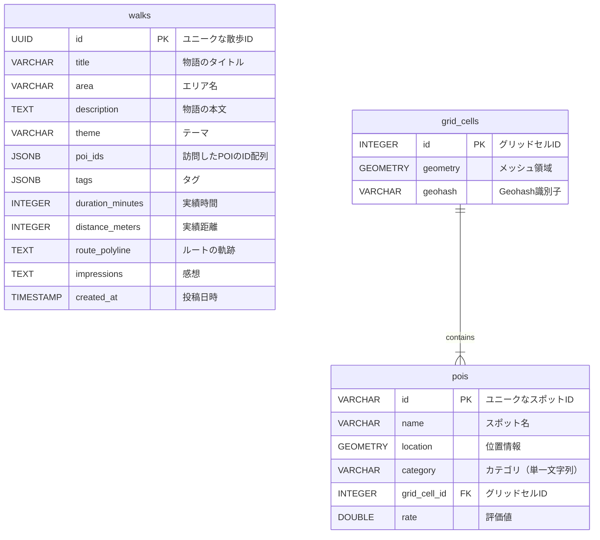

### **インデックス**

- `pois`テーブルの外部キー (`grid_cell_id`)
- `pois`テーブルの`location`（GiSTインデックス）、`category`（BTREEインデックス）
- `grid_cells`テーブルの`geometry`（GiSTインデックス）、`geohash`（BTREEインデックス）

## Firestoreのデータ構造

- **コレクション:** `grid_cells`
    - **ドキュメントID:** 各グリッドのユニークID (例: `osaka_grid_123`)
        - **フィールド:** `pois`
        - **型:** 配列
        - **内容:** そのグリッド内に存在する、複数の「POIオブジェクト」

### 「POIオブジェクト」に含めるべきデータ

- **`id` (文字列):**
    - **内容:** スポットのユニークID（Google Place IDなど）。
    - **理由:** Supabaseの完全なデータと紐付けるための**識別子**として必須です。
- **`name` (文字列):**
    - **内容:** スポットの名称（例: 「ブルーボトルコーヒー」）。
    - **理由:** ルート提案時に「〇〇に寄るルート」と表示するなど、**最低限の表示**に必要です。
- **`location` (ジオポイント):**
    - **内容:** スポットの緯度経度。Firestoreの`GeoPoint`型を使います。
    - **理由:** ルート計算を行う上で、**位置情報**は絶対に欠かせません。
- **`category` (文字列):**
    - **内容:** メインカテゴリ（例: `"cafe"`, `"park"`, `"art_gallery"`）。
    - **理由:** 「カフェに寄りたい」といったユーザーの希望に応じて、**スポットをフィルタリングする**ために使います。
- **`rating` (数値):**
    - **内容:** スポットの評価（Googleレビューの評価など、1.0〜5.0）。
    - **理由:** 寄り道候補が多数ある場合に、「評価4.0以上のスポットだけを対象にする」など、**提案の質を上げるための指標**になります。

```json
[
  {
    "id": "ChIJN1t_tDeuEmsRUsoyG83frY4",
    "name": "スターバックスコーヒー 八重洲地下街店",
    "location": { "latitude": 35.681, "longitude": 139.768 },
    "category": "cafe",
    "rating": 3.8
  },
  {
    "id": "ChIJC_zAsDGtEmsR6I234567890",
    "name": "日比谷公園",
    "location": { "latitude": 35.675, "longitude": 139.758 },
    "category": "park",
    "rating": 4.4
  }
]
```

---

### 1. ルート提案の生成

- `POST /routes/proposals`
- **Request Body**:

```json
{
  "start_location": {
    "latitude": 35.0116,
    "longitude": 135.7681
  },
  "destination_location": { // 目的地なし（お散歩モード）の場合はnull
    "latitude": 35.0211,
    "longitude": 135.7561
  },
  "mode": "destination", // "destination" or "time_based"
  "time_minutes": 60, // modeが "time_based" の場合に必須
  "theme": "gourmet",
  "realtime_context": { // AIの物語生成に使用
      "weather": "sunny", // "sunny", "cloudy", "rainy"など
      "time_of_day": "afternoon" // "morning", "afternoon", "evening"
  }
}
```

- **Response Body (200 OK)**:

```json
{
  "proposals": [
    {
      "proposal_id": "temp_prop_1a2b3c", // ユーザーが選択するまでの一時ID
      "title": "黄昏の蜜蜂が紡ぐ、古き良き商店街の物語",
      "estimated_duration_minutes": 45,
      "estimated_distance_meters": 2100,
      "theme": "gourmet",
      "display_highlights": [
        "老舗和菓子店",
        "昭和レトロ喫茶",
        "手作り雑貨店"
      ],
      "navigation_steps": [
        {
          "type": "navigation", // 種別：ただの道のり
          "description": "商店街入口へ向かう",
          "distance_to_next_meters": 200
        },
        {
          "type": "poi", // 種別：立ち寄りスポット
          "poi_id": "poi_unique_id_123",
          "name": "老舗和菓子店「蜜月堂」",
          "description": "老舗和菓子店「蜜月堂」を発見",
          "latitude": 35.0125,
          "longitude": 135.7692,
          "distance_to_next_meters": 150
        },
        {
          "type": "poi",
          "poi_id": "poi_unique_id_123",
          "name": "昭和レトロ喫茶「黄昏」",
          "description": "昭和レトロ喫茶「黄昏」で休憩",
          "latitude": 35.0148,
          "longitude": 135.7655,
          "distance_to_next_meters": 300
        },
        {
          "type": "poi",
          "poi_id": "poi_unique_id_123",
          "name": "手作り雑貨店「小さな宝箱」",
          "description": "手作り雑貨店で宝物探し",
          "latitude": 35.0180,
          "longitude": 135.7601,
          "distance_to_next_meters": 250
        }
      ],
      "route_polyline": "o~y_I}nveYE~@qK`AyAdAo@~EaB`Be@",
      "generated_story": "昭和の香りが漂う商店街を抜け、隠れた名店で地元の人々との出会いを楽しむ散歩です。"
    },
    // 他の提案が続く...
  ]
}
```

---

### 2. ルートの再計算

- `POST /routes/recalculate`
- **Request Body**:

```json
{
  "current_location": { // ユーザーの現在地
    "latitude": 35.0135,
    "longitude": 135.7672
  },
  "destination_location": { // 目的地なし（お散歩モード）の場合はnull
    "latitude": 35.0211,
    "longitude": 135.7561
  },
  "mode": "destination", // "destination" or "time_based"
  "original_story_context": { // 物語の文脈を維持するための情報
     "title": "黄昏の蜜蜂が紡ぐ、古き良き商店街の物語",
     "theme": "gourmet",
     "previous_pois": [
		    { "name": "老舗和菓子店「蜜月堂」", "poi_id": "poi_unique_id_123"},
		    { "name": "昭和レトロ喫茶「黄昏」", "poi_id": "poi_unique_id_123"}
		 ],
  },
   "realtime_context": {
      "weather": "sunny",
      "time_of_day": "afternoon"
  }
}
```

- **Response Body (200 OK)**:

```json
{
  "updated_route": {
      "title": "路地裏で見つけた、新たな蜜の味",
      "estimated_duration_minutes": 35,
      "estimated_distance_meters": 1800,
      "highlights": [ /* ... 新しい立ち寄りスポットのリスト ... */ ],
      "route_polyline": "e`z_I}aweYFp@uEb@yB^y@",
      "generated_story": "元の道から少し外れて、隠れたギャラリーに立ち寄ってみましょう"
  }
}
```

---

### 3. 散歩の記録を投稿

- `POST /walks`
- **Request Body**:

```json
{
  "title": "黄昏の蜜蜂が紡ぐ、古き良き商店街の物語",
  "description": "最終的に完成した物語の全文です...",
  "mode": "destination", // "destination" or "time_based"
  "theme": "gourmet",
  "actual_duration_minutes": 48,
  "actual_distance_meters": 2300,
  "route_polyline": "o~y_I}nveYE~@qK`AyAdAo@~EaB`Be@...",
  "start_location": { "latitude": 35.0116, "longitude": 135.7681 },
  "visited_pois": [
    { "name": "老舗和菓子店「蜜月堂」", "poi_id": "poi_unique_id_123", "latitude": 35.0125, "longitude": 135.7692 },
    { "name": "昭和レトロ喫茶「黄昏」", "poi_id": "poi_unique_id_123", "latitude": 35.0148, "longitude": 135.7655 }
  ],
  "impressions": "とても楽しい散歩でした！喫茶店のコーヒーが美味しかったです。"
}
```

- **Response Body (201 Created)**:

```json
{
  "status": "success",
}
```


### 4. ハニカムマップのデータを取得

- `GET /walks`
- **Query Parameters**:
    - `bbox`: 地図の表示領域を示すバウンディングボックス
        - （例: `min_lng,min_lat,max_lng,max_lat`）
- **Response Body (200 OK)**:

```json
{
  "walks": [
    {
      "id": "walk_uuid_cde456",
      "title": "雨上がりの虹色散歩道",
      "area_name": "渋谷・表参道エリア",
      "date": "2024年1月15日",
      "summary": "雨上がりの街に現れた小さな虹を追いかけて、思いがけない出会いと発見に満ちた散歩になりました。",
      "duration_minutes": 38,
      "distance_meters": 2100,
      "tags": ["自然", "偶然の出会い", "雨上がり"],
      "end_location": {
        "latitude": 35.6595,
        "longitude": 139.7005
      },
      "route_polyline": "g{y_FwjtoWq@zCqBfH_@dAk@lA_BlCi@~@_AdB"
    },
    {
      "id": "walk_uuid_fgh789",
      "title": "弟たちが案内する、隠れ家カフェ巡り",
      "area_name": "下北沢エリア",
      "date": "2024年1月12日",
      "summary": "街角の猫たちに導かれるように、知る人ぞ知る素敵なカフェを3軒も発見。猫好きにはたまらない散歩でした。",
      "duration_minutes": 52,
      "distance_meters": 1800,
      "tags": ["カフェ", "猫", "隠れ家"],
      "end_location": {
        "latitude": 35.6635,
        "longitude": 139.6675
      },
      "route_polyline": "a}z_F`itoWp@yCp@kCf@uB`@sB`@wB~@yE"
    },
    {
      "id": "walk_uuid_ijk012",
      "title": "夕暮れ時の商店街、人情物語",
      "area_name": "谷中・根津エリア",
      "date": "2024年1月15日",
      "summary": "夕暮れの商店街で出会った優しい店主さんたちとの心温まる交流。昭和の香りが残る街の魅力を再発見。",
      "duration_minutes": 45,
      "distance_meters": 2300,
      "tags": ["商店街", "人情", "昭和レトロ"],
      "end_location": {
        "latitude": 35.7278,
        "longitude": 139.7739
      },
      "route_polyline": "s~aaG`nvoW`@oAv@gC`AsDlB}Hb@yAb@_B"
    }
  ]
}
```

---

### 5. 特定の散歩の詳細データを取得

ユーザーがマップ上のピンをタップした際に、その散歩の詳細（追体験用データ）を取得します。

- **Endpoint**: `GET /walks/{id}`
- **Response Body (200 OK)**:

```json
{
  "id": "walk_uuid_cde456",
  "title": "雨上がりの虹色散歩道",
  "area_name": "渋谷・表参道エリア",
  "date": "2024年1月15日",
  "description": "雨上がりの街に現れた小さな虹を追いかけて、思いがけない出会いと発見に満ちた散歩になりました。",
  "theme": "nature",
  "duration_minutes": 38,
  "distance_meters": 2100,
  "route_polyline": "g{y_FwjtoWq@zCqBfH_@dAk@lA_BlCi@~@_AdB",
  "tags": ["自然", "癒やし", "雨上がり"],
  "navigation_steps": [
    {
      "type": "poi",
      "name": "青山公園",
      "description": "公園による",
      "distance_to_next_meters": 200,
      "latitude": 35.6640,
      "longitude": 139.7140
    },
    {
      "type": "poi",
      "name": "表参道カフェ",
      "description": "おしゃれなカフェで休憩",
      "distance_to_next_meters": 150,
      "latitude": 35.6670,
      "longitude": 139.7120
    },
    {
      "type": "poi",
      "name": "虹の橋展望台",
      "description": "展望台からの眺めを楽しむ",
      "distance_to_next_meters": 300,
      "latitude": 35.6700,
      "longitude": 139.7100
    }
  ]
}
```