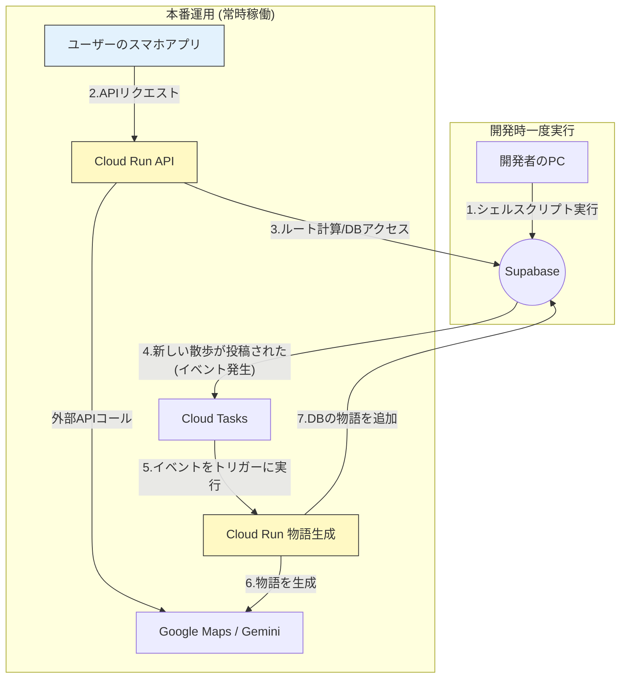

### アーキテクチャ図

### 1. Supabase (PostgreSQL + PostGIS)

- 役割:
    
    アプリケーションのメインデータベースです。ユーザーが投稿した散歩の物語(walksテーブル)や、ルート計算の元となるスポット情報(poisテーブル)など、全ての永続データを格納します。
    
- **使われるタイミング:**
    - ルート検索時・再検索時に、スポット情報を読み出す。
    - 散歩完了時に、新しい「散歩の物語」を書き込む。
    - 「ハニカムマップ」表示時に、投稿された物語リストを読み出す。
- **選定理由:**
    - **PostGISが標準で使える**ため、`GEOMETRY`型を扱う今回のアプリに必須。
    - **イベント通知機能**があり、Eventarcとの連携が非常にスムーズ。
    - 寛大な無料枠とBaaS機能が、**初期開発のスピードとコスト**を劇的に改善します。

---

### 2. Cloud Run APIサーバー

- 役割:
    
    このアプリの「脳」です。スマホアプリからのリクエストを受け取り、ルート計算、物語生成の指示、DBとの通信など、ほとんどのビジネスロジックを実行します。
    
- 使われるタイミング:
    
    ルート検索、気まぐれなルート変更、散歩の投稿など、ユーザーがサーバー側の処理を必要とするあらゆる操作で呼び出されます。
    
- **選定理由:**
    - **サーバーレス**であるため、インフラ管理が不要で、アクセスがない時のコストはほぼゼロ。
    - トラフィックに応じて**自動でスケール**するため、将来的なユーザー増にも柔軟に対応できます。

---

### 3. Cloud Tasks + Cloud Run (非同期の物語生成)

- 役割:
    
    ユーザーを待たせることなく、バックグラウンドでAIによる物語生成を完了させるための非同期処理ユニットです。
    
- 使われるタイミング:
    
    ユーザーが散歩を投稿し、Supabaseのwalksテーブルに新しい行が追加された直後に、Eventarcがそのデータベースイベントを検知して、物語生成用のCloud Runを自動で起動
    
- **選定理由:**
    - **最高のユーザー体験**のため。ユーザーは重いAIの処理を待つことなく、瞬時に「投稿完了」の応答を受け取れます。
    - **システムの安定性**のため。AIのAPIが一時的に不調でも、メインの投稿処理には影響が出ません。

---

### 4. 手元のシェル実行 (カンニングペーパー作成)

- 役割:
    
    開発者が一度だけ手元で実行する、スポット情報(poisテーブル)の初期データ投入スクリプトです。
    
- 使われるタイミング:
    
    本番運用前、開発フェーズでのみ使用します。
    
- **選定理由:**
    - **開発速度の最大化**のため。MVP開発（1ヶ月）の段階では、Cloud Run Jobsのような自動化パイプラインを構築するよりも、手軽なシェル実行で済ませる方が合理的です。