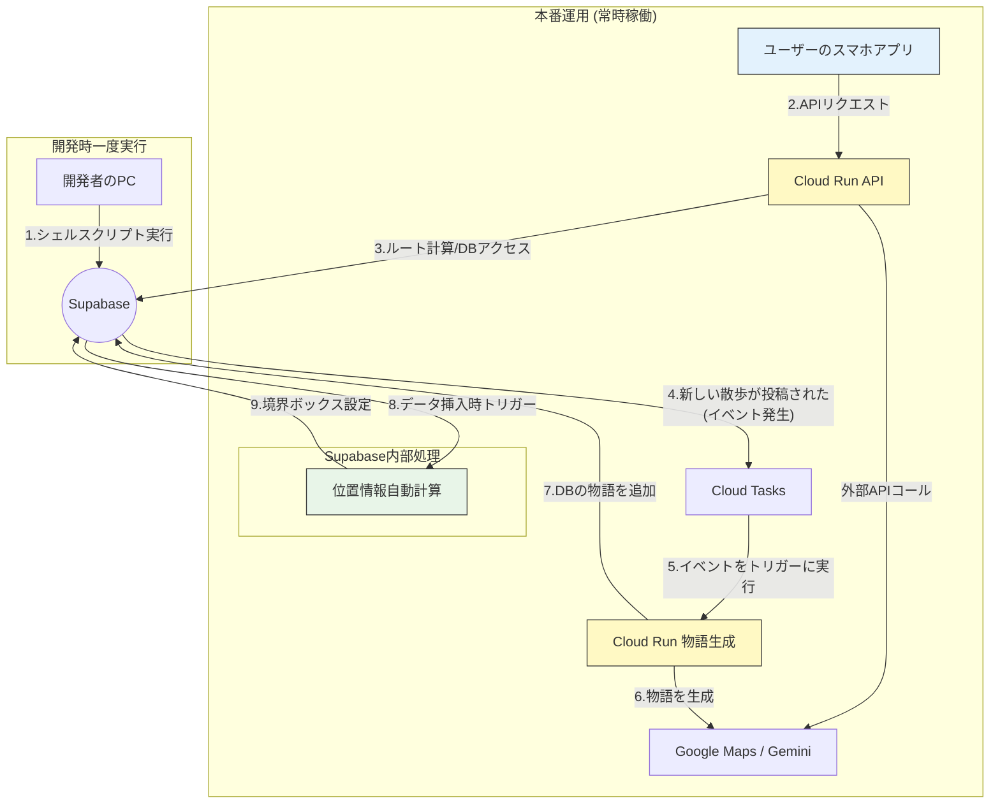

### アーキテクチャ図



**処理フローの説明:**
- **5-7番**: 散歩投稿時に、Cloud Tasksが物語の詳細化、タグの自動生成、エリア名の標準化を非同期実行
- **8-9番**: 散歩記録の投稿時に、Supabaseトリガーが`route_polyline`から`route_bounds`を自動計算
- この自動化により、Cloud Runでの地理計算処理が不要となる

### 1. Supabase (PostgreSQL + PostGIS)

- 役割:
    
    アプリケーションのメインデータベースです。ユーザーが投稿した散歩の物語(walksテーブル)や、ルート計算の元となるスポット情報(poisテーブル)など、全ての永続データを格納します。POIテーブルでは、各スポットのカテゴリを配列として管理し、効率的な検索を実現しています。また、スポットの詳細情報URLも保存できるようになりました。
    
- **使われるタイミング:**
    - ルート検索時・再検索時に、スポット情報を読み出す。
    - 散歩完了時に、新しい「散歩の物語」を書き込む。
    - 「ハニカムマップ」表示時に、投稿された物語リストを読み出す。
- **選定理由:**
    - **PostGISが標準で使える**ため、`GEOMETRY`型を扱う今回のアプリに必須。
    - **イベント通知機能**があり、Eventarcとの連携が非常にスムーズ。
    - 寛大な無料枠とBaaS機能が、**初期開発のスピードとコスト**を劇的に改善します。

---

### 2. Cloud Run APIサーバー

- 役割:
    
    このアプリの「脳」です。スマホアプリからのリクエストを受け取り、ルート計算、物語生成の指示、DBとの通信など、ほとんどのビジネスロジックを実行します。
    
- 使われるタイミング:
    
    ルート検索、気まぐれなルート変更、散歩の投稿など、ユーザーがサーバー側の処理を必要とするあらゆる操作で呼び出されます。
    
- **選定理由:**
    - **サーバーレス**であるため、インフラ管理が不要で、アクセスがない時のコストはほぼゼロ。
    - トラフィックに応じて**自動でスケール**するため、将来的なユーザー増にも柔軟に対応できます。

---

### 3. Cloud Tasks + Cloud Run (非同期の物語生成)

- 役割:
    
    ユーザーを待たせることなく、バックグラウンドでAIによる物語生成と散歩のメタデータ自動生成を完了させるための非同期処理ユニットです。
    
- 使われるタイミング:
    
    ユーザーが散歩を投稿した際に、Cloud Tasksで以下の処理を非同期実行します：
    1. **物語の詳細化**: ユーザーが投稿した散歩記録をもとに、AIが豊かな物語として拡張
    2. **タグの自動生成**: 散歩の内容、訪問したPOI、感想などを分析してJSONB tags配列を自動生成
    3. **エリア名の標準化**: 位置情報から適切な地域名を特定・設定
    
    これらの処理は、Supabaseのwalksテーブルに新しい行が追加された直後に、データベースイベントを検知して物語生成用のCloud Runを自動で起動します。
    
- **選定理由:**
    - **最高のユーザー体験**: ユーザーは重いAIの処理を待つことなく、瞬時に「投稿完了」の応答を受け取れます
    - **システムの安定性**: AIのAPIが一時的に不調でも、メインの投稿処理には影響が出ません
    - **自動メタデータ生成**: タグやエリア名の自動生成により、検索性とユーザビリティが向上します
    - **地理計算の効率化**: Supabaseトリガーにより位置情報処理をデータベース側で完結させ、アプリケーション層の負荷を軽減します

---

### 4. Supabaseトリガー機能 (地理情報の自動処理)

- **役割:**
    
    散歩記録の投稿時に、ルートポリラインから境界ボックスを自動計算し、効率的な地理検索を可能にする自動化処理です。
    
- **使われるタイミング:**
    
    `walks`テーブルへの新規INSERT時およびUPDATE時に、`trigger_auto_calculate_walk_bounds`が自動実行され、`route_polyline`から`route_bounds`（境界ボックス）を計算・設定します。
    
- **実装詳細:**
    ```sql
    -- ポリラインから境界ボックスを自動計算
    CREATE TRIGGER trigger_auto_calculate_walk_bounds
        BEFORE INSERT OR UPDATE ON walks
        FOR EACH ROW
        EXECUTE FUNCTION auto_calculate_walk_bounds();
    ```
    
- **選定理由:**
    - **リアルタイム処理**: データ挿入と同時に地理計算が完了するため、追加のAPIコールが不要
    - **データ整合性**: アプリケーション側のバグや処理漏れに関係なく、常に正確な境界ボックスが設定される
    - **パフォーマンス最適化**: PostGISの高速な空間計算をデータベース内で完結させることで、検索クエリの大幅な高速化を実現
    - **インフラコスト削減**: Cloud Runでの地理計算処理が不要になり、サーバーレス実行時間とコストを削減

---

### 5. 手元のシェル実行 (カンニングペーパー作成)

- 役割:
    
    開発者が一度だけ手元で実行する、スポット情報(poisテーブル)の初期データ投入スクリプトです。
    
- 使われるタイミング:
    
    本番運用前、開発フェーズでのみ使用します。
    
- **選定理由:**
    - **開発速度の最大化**のため。MVP開発（1ヶ月）の段階では、Cloud Run Jobsのような自動化パイプラインを構築するよりも、手軽なシェル実行で済ませる方が合理的です。