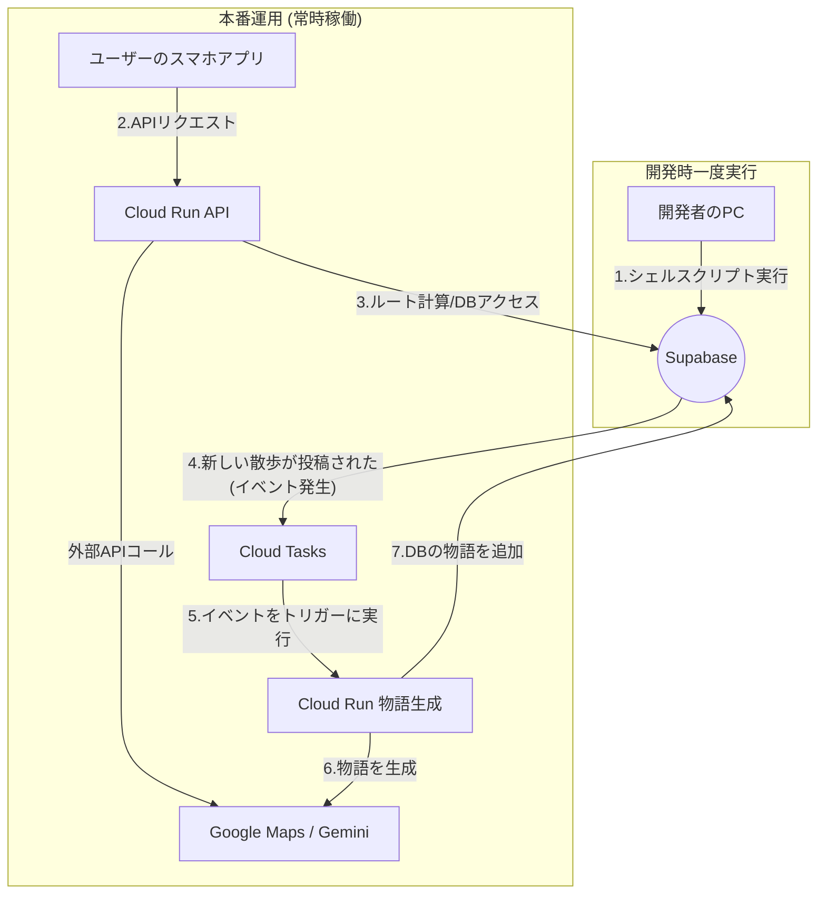

# Team8-App Terraform インフラストラクチャ

このディレクトリには、散歩アプリのバックエンドシステムの Terraform コードが含まれています。

## アーキテクチャ概要



## ディレクトリ構造

```
terraform/
├── modules/                    # 再利用可能なTerraformモジュール
│   ├── apis/                  # Google Cloud API有効化
│   ├── cloud-run/             # Cloud Runサービス
│   ├── cloud-tasks/           # Cloud Tasksキュー
│   ├── service-account/       # サービスアカウント管理
│   └── firestore-service-account/  # Firestore アクセス用SA
└── environments/              # 環境別設定
    └── dev/                   # 開発環境
        ├── main.tf            # メインTerraform設定
        ├── variables.tf       # 変数定義
        └── terraform.tfvars.example # 設定例
```

## リソース構成

### Google Cloud Services

- **Cloud Run**: API サーバーと物語生成サーバー
- **Cloud Tasks**: 非同期物語生成処理
- **Service Accounts**: 各サービス用の権限管理
- **Firestore**: befree データベースアクセス用サービスアカウント
- **IAM**: 適切な権限設定

### 外部サービス

- **Supabase**: PostgreSQL データベース
- **Google Maps API**: ルート計算
- **Gemini API**: 物語生成

## 使用方法

### 1. 前提条件

- Terraform >= 1.0
- Google Cloud CLI
- 適切な GCP プロジェクトの権限

### 2. 初期設定

```bash
# Google Cloud CLIでの認証
gcloud auth login
gcloud auth application-default login

# プロジェクトIDを設定
gcloud config set project YOUR_PROJECT_ID
```

### 3. インフラのデプロイ

```bash
cd environments/dev

# terraform.tfvarsファイルを作成
cp terraform.tfvars.example terraform.tfvars
# 必要な値を編集

# Terraformの初期化
terraform init

# プランの確認
terraform plan

# インフラストラクチャの作成
terraform apply
```

### 4. Firestore サービスアカウントの作成

befree Firestore データベースへのアクセス用サービスアカウントを作成します。

```bash
# 自動デプロイスクリプトを使用
./deploy-firestore-service-account.sh

# または個別に実行
cd environments/dev
terraform apply -target=module.firestore_service_account
```

#### 生成されるリソース

- **サービスアカウント**: `befree-firestore-access@{project-id}.iam.gserviceaccount.com`
- **権限**: 
  - `roles/datastore.user` (Firestore読み書き)
  - `roles/firebase.adminServiceAgent` (Firebase Admin SDK)
- **JSONキー**: `./keys/befree-firestore-key.json`

#### 環境変数設定

```bash
export FIRESTORE_PROJECT_ID="your-project-id"
export GOOGLE_APPLICATION_CREDENTIALS="./keys/befree-firestore-key.json"
```

### 必須変数

- `project_id`: GCP プロジェクト ID
- `database_url`: Supabase データベース接続 URL
- `google_maps_api_key`: Google Maps API キー
- `gemini_api_key`: Gemini API キー
- `app_server_image`: API サーバーのコンテナイメージ URL
- `story_server_image`: 物語生成サーバーのコンテナイメージ URL

### オプション変数

- `region`: デプロイするリージョン（デフォルト: asia-northeast1）

## 構成の詳細

### 開発環境
- Cloud Run サービス名: `dev-app-server`, `dev-story-server`
- Cloud Tasks キュー: `dev-story-queue`
- 環境変数: `ENVIRONMENT=development`

## セキュリティ考慮事項

### 本番環境での推奨事項

1. **Google Secret Manager の使用**

   ```bash
   # APIキーをSecret Managerで管理
   gcloud secrets create google-maps-api-key --data-file=key.txt
   gcloud secrets create gemini-api-key --data-file=key.txt
   ```

2. **リモート状態管理**

   ```hcl
   terraform {
     backend "gcs" {
       bucket = "your-terraform-state-bucket"
       prefix = "terraform/state"
     }
   }
   ```

3. **terraform.tfvars ファイルの暗号化**

   ```bash
   # git-cryptやSOPSを使用してtfvarsファイルを暗号化
   ```

4. **最小権限の原則**
   - 各サービスアカウントには必要最小限の権限のみ付与
   - ネットワークレベルでの制限（VPC など）
   
5. **アクセス制御**
   - Terraformの実行は特定のCI/CDパイプラインのみに制限
   - 開発者の直接的な本番環境アクセスを制限

## モニタリングとログ

Cloud Run サービスには以下が自動的に設定されます：

- **Cloud Logging**: アプリケーションログの収集
- **Cloud Monitoring**: メトリクスとアラート
- **Error Reporting**: エラーの自動検出と報告

## トラブルシューティング

### よくある問題

1. **API 有効化エラー**

   ```bash
   # 必要なAPIが有効化されているか確認
   gcloud services list --enabled
   ```

2. **権限エラー**

   ```bash
   # 現在の権限を確認
   gcloud auth list
   gcloud projects get-iam-policy YOUR_PROJECT_ID
   ```

3. **リソース制限エラー**
   ```bash
   # プロジェクトのクォータを確認
   gcloud compute project-info describe --project=YOUR_PROJECT_ID
   ```

## 料金最適化

### 開発環境

- 最小インスタンス数を 0 に設定
- 低い CPU・メモリ制限

### 本番環境

- Cloud Run の自動スケーリング活用
- 適切なタイムアウト設定
- 不要なログの削減

## 貢献

インフラストラクチャの変更を行う場合：

1. 開発環境で十分にテスト
2. terraform plan での変更内容確認
3. 段階的なデプロイメント
4. モニタリングとログの確認
